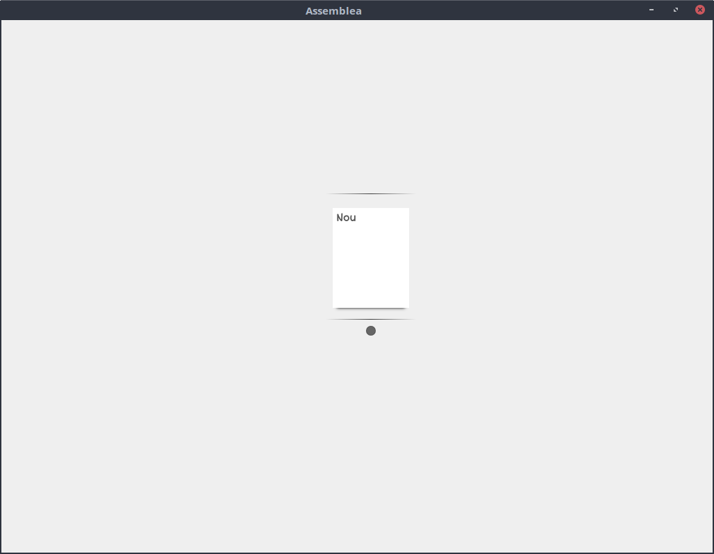

# Class Jam. L'assemblea d'Aula.

Una de les pràctiques habituals en les aules d'infantil, primària i educació especial és la realització de l'assemblea o el racó d'aula. L'eina Class Jam ens dóna la possibilitat de realitar aquesta assemblea d'aula de forma interactiva amb la pissarra digital.

D'entre tot l'alumnat a qui va dirigida l'aplicació, aquesta té especial interès per als alumnes de centres d'educació especial, ja que aquests requereixen una major estimulació en tot allò que fan. El fet de realitzar aquestes primeres rutines del dia de forma interactiva i visual, pot ser força positiu per a ells.

## Què és l'eina Class Jam (Assemblea d'Aula)?

Es tracta d'una aplicació d'escriptori per a LliureX basada en tecnologia web, el que aporta una interfície d'usuari molt amigable i senzilla.

L'aplicació disposa de diferents components, que li aporten la funcionalitat, i que permeten:

* Triar el dia de la setmana,
* Decidir l'oratge d'avui,
* Establir l'estació de l'any,
* Escollir el mes actual,
* Passar llista, per veure quins companys han vingut a classe i quins s'han quedat a casa.
* Fer una revisió de les activitats que realitzaran durant el dia.

## Instal·lació de l'Assemblea d'Aula

L'Assemblea d'Aula (paquet class-jam) està disponible a LliureX a través de la LliureX Store, o bé del Synaptic.

## Primers passos amb l'Assemblea

Només iniciar l'aplicació, tenim la possibilitat de crear una assemblea nova o treballar amb una creada anteriorment:

</img>

En aquest cas, com que és la primera vegada que llancem l'assemblea, només en podem crear una de nova. Així que fem clic dues vegades sobre el botó de "Nou", per tal de crear una assemblea nova. Per a això, haurem d'indicar el nom d'aquesta i triar alguna imatge per tal d'identificar-la.

</img>

Una vegada tinguem el nom i la imatge seleccionats, donem a "Crea l'Assemblea", i veurem l'aspecte inicial d'aquesta:

</img>

Com veiem, tenim a l'esquerra, agrupats tots els components de l'assemblea, i a la part superior dreta, la icona del menú de l'aplicació.

Si fem clic al botó del menú, se'ns desplegaran les següents opcions:

* Canvi al mode d'edició: L'assemblea d'aula té dos modes de funcionament. El mode d'assemblea, pensat per fer l'assemblea amb els alumnes, i el mode d'edició. Amb aquest mode d'edició, els professors poden triar l'organització i la mida de cada components, així com personalitzar aquests, i decidir quins apareixen i quins no.

* Guardar l'estat de l'Assemblea, per tal de guardar l'organització i la configuració actual.

* Tancar l'Assemblea.

</img>

Si ara entrem al mode d'edició, veurem que la interfície canvia lleugerament: Per una banda, tindrem els components, marcats amb un altre color i amb les vores ratllades, indicant que aquests es poden moure i redimensionar. Si passem el ratolí per damunt d'algun d'aquests components, veurem com ens apareix una marca a la part inferior dreta del component, indicant que podem canviar les seues dimensions. Cada component té una grandària màxima i mínima possible, en funció de les seues característiques.

En aquest moment, podem moure i redimensionar els components, i observarem com la seua distribució s'adapta per tal que no es superposen uns components i altres.

Si ara ens fixem de nou amb les opcions del menú, veurem que aquestes han variat significativament, i ara tenim les següents opcions:

* Passar al mode Assemblea, per tornar a l'assemblea per als alumnes
* Configurar els mòduls, per tal de triar quins mòduls volem visibles i quins no, en funció del que volguem treballar amb els alumnes.
* Guardar la configuració de l'assemblea
* Eixir de l'assemblea

</img></img>

Ara només ens queda configurar cadascun dels components. Per a això, haurem de fer doble clic en el component que volguem configurar. Els mòduls de selecció de dia, mes, oratge i estació de l'any tenen un diàleg de configuració molt semblant, i en ell, només caldrà que triem quines opcions volem que estiguen visibles i quines no. Per exemple, el selector del clima té un aspecte semblant al següent:

</img>

Com podem veure, fent clic sobre les diferents opcions, podem marcar que aquestes es mostren o no. Per exemple, si un grup de xiquets molt menuts només treballa amb si fa sol, està núvol o plou, només deixaríem visibles estes tres opcions.

Per altra banda, el component per passar llista, és una miqueta més complex, i ens permet afegir alumnes, configurant el seu nom i posant una foto.

</img>

Una vegada tinguem l'assemblea configurada, només haurem de passar al mode d'Assemblea, i anar fent clic sobre els diferents components d'aquesta per tal de realitzar l'Assemblea de dia.

